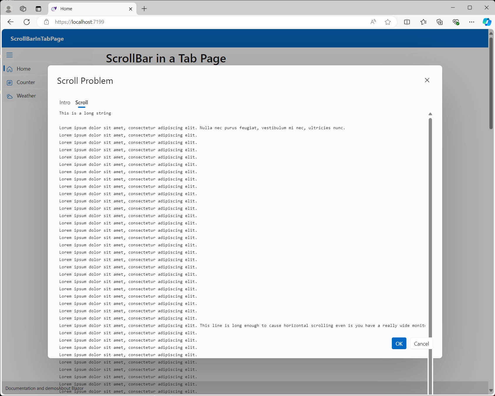

# Scrolling does not work in a FluentTab in a FluentDialog

This repository was created to reproduce an issue with the Fluent UI for Blazor library.
Here is this issue: https://github.com/microsoft/fluentui-blazor/issues/2738

If the contents of a FluentTab are too large to fit in the tab, the tab should be scrollable.
However, this is not the case in a FluentDialog. A scroll bar is added but, the fluent-tab-panel
is too large so the contents and the scroll bar run off the bottom of the dialog.

Here is a screenshot of the issue:

# Fix/Workaround

This issue can be fixed by changing Height="100%" to Height="62vh" in TabWithScrollDialog.

However, there is a second issue, the horizontal scrollbar is placed at the bottom of the
content instead of the bottom of the dialog. So, you have to scroll to the bottom in order
to scroll horizontally.

The horizontal scroll bar issue was reported here:
https://github.com/microsoft/fluentui-blazor/issues/2743

And, the resolution for that issue is to add Style="display:flex" to the Scroll FluentTab element.
